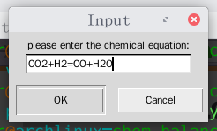
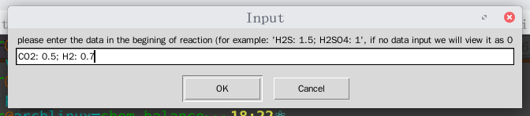
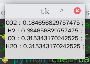

# A simple script to calculate the chemical equilibrium
### environment: python3 with re, sympy libs installed
## Usage:
**Linux Environment:**
```
./chem-balance.py
```
or
```
python chem-balance.py
```
and when dialog appeared, enter the data it requires:
### example






##### Found a online equilibrium calculator
[http://navier.engr.colostate.edu/~dandy/code/code-4/](http://navier.engr.colostate.edu/~dandy/code/code-2/)
